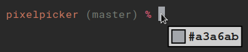

# pixelpicker



Simple program to capture the color of a pixel on the screen.

# Features

- Color of pixel is printed in standard output (hex representation)
- Preview of the color under the cursor
- Customizable colors for the preview UI

# Usage example

As a key binding for i3 using `xclip` to send color to clipboard:

```
bindsym $mod+Shift+p exec --no-startup-id pixelpicker -n | xclip -selection clipboard
```

# Installation

## Arch Linux

From a clone of this repository:

```
makepkg -i
```

## Others

Install dependencies:

- gtk3
- cairo
- Python 3
- PyGObject ([installation guide](https://pygobject.readthedocs.io/en/latest/getting_started.html))
- `pycairo` Python package

Then place the `pixelpicker` file somewhere in your `$PATH`.

